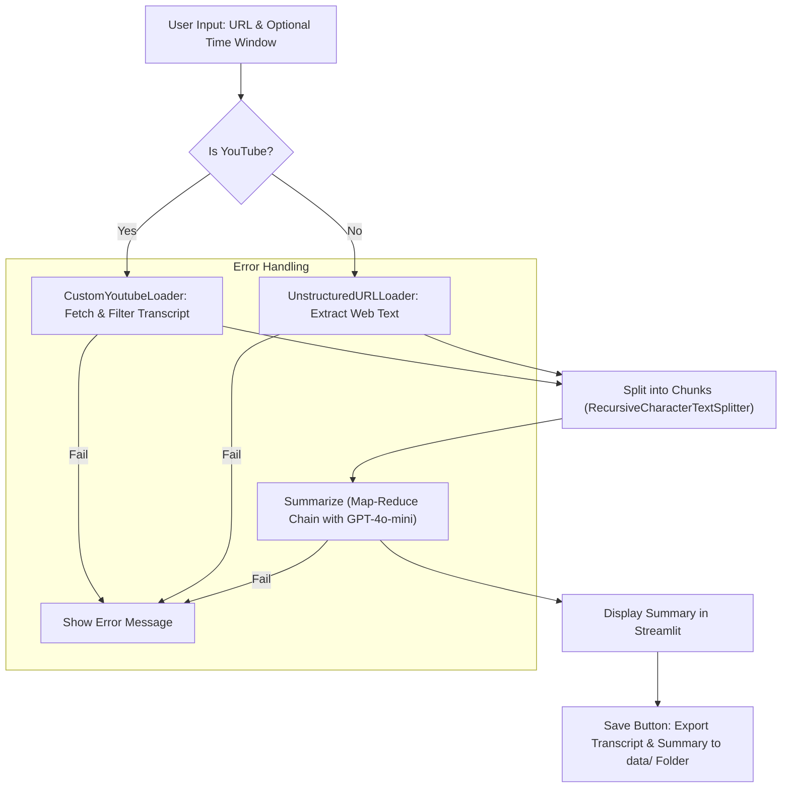

# Text Summarizer: AI-Powered Summarization of YouTube Videos and Web Pages

## Overview

This project implements an intelligent text summarization application designed to extract and condense content from YouTube videos (via transcripts) and arbitrary web pages. Leveraging large language models (LLMs) and natural language processing (NLP) techniques, the tool generates concise summaries in Brazilian Portuguese, incorporating motivational titles and quotes. The application is built using Streamlit for the user interface, LangChain for orchestration, and OpenAI's GPT-4o-mini for summarization.

The primary goal is to facilitate efficient information extraction from multimedia and web sources, addressing challenges such as information overload in digital content consumption. This aligns with academic interests in NLP, where summarization techniques like map-reduce chains enable scalable processing of long-form text (Abney, 1991).

## Features

- **YouTube Transcript Loading**: Fetches and processes video transcripts with support for language fallbacks (e.g., English, Portuguese) and optional time windows (e.g., summarize from 1:00:00 to 2:00:00).
- **Web Page Loading**: Extracts text from generic URLs using unstructured loading.
- **Chunking and Summarization**: Splits content into manageable chunks and applies a map-reduce summarization chain for efficient processing.
- **Persistent State**: Uses Streamlit session state to maintain summaries across interactions.
- **Save Functionality**: Exports full transcripts and summaries to text files in a `data/` directory, with filenames based on video titles or IDs.
- **Error Handling**: Graceful management of common issues like disabled transcripts or invalid URLs.
- **Customization**: Configurable chunk sizes, prompts, and LLM parameters.

## Installation

1. **Clone the Repository**:
   ```
   git clone https://github.com/viniciusrondon/Text-Summarizer-AI-Methods.git
   cd Text-Summarizer-AI-Methods
   ```

2. **Set Up Virtual Environment** (using uv for dependency management):
   ```
   uv venv
   source .venv/bin/activate  # On Linux/Mac
   # or .venv\Scripts\activate on Windows
   uv sync
   ```

3. **Environment Variables**:
   Create a `.env` file in the root directory with your API keys:
   ```
   OPENAI_API_KEY=your_openai_key
   LANGCHAIN_API_KEY=your_langsmith_key  # Optional for tracing
   LANGCHAIN_PROJECT=your_project_name
   HF_TOKEN=your_huggingface_token  # If needed
   ```

4. **Run the App**:
   ```
   streamlit run app.py
   ```

## Usage

1. Open the app in your browser (defaults to http://localhost:8501).
2. Enter a YouTube URL or web page URL.
3. (Optional) Specify start/end times for YouTube videos (HH:MM:SS format).
4. Click "Summarize" to generate the summary.
5. Use "Save Transcription and Summary" to export files to the `data/` folder.

For long videos, the app may warn about potential issues; confirm to proceed.

### Example
- Input: https://www.youtube.com/watch?v=dQw4w9WgXcQ
- Output: A concise summary in Brazilian Portuguese, with options to view chunks and save files.

## Architecture

The application's workflow follows a modular pipeline, illustrated below using a Mermaid flowchart. This design ensures scalability and error resilience.



- **Loading**: Custom loader handles YouTube specifics; unstructured for web.
- **Chunking**: Balances granularity and efficiency.
- **Summarization**: Map-reduce distributes computation, reducing token limits (inspired by Lewis et al., 2019).
- **Persistence**: Session state prevents data loss on reruns.

## Technical Details

- **Dependencies**: LangChain (for chains and loaders), Streamlit (UI), OpenAI (LLM), youtube-transcript-api (transcripts), pytube (metadata).
- **Customization**: Prompts are tailored for Brazilian Portuguese summaries with motivational elements.
- **Limitations**: Dependent on YouTube transcript availability; long videos may incur high API costs or timeouts. No support for audio-based transcription (e.g., via Whisper).

## References
- Abney, S. (1991). Parsing by Chunks. In *Principle-Based Parsing*. Kluwer Academic Publishers.
- Lewis, M., et al. (2019). BART: Denoising Sequence-to-Sequence Pre-training for Natural Language Generation, Translation, and Comprehension. arXiv:1910.13461.
- Project inspired by LangChain documentation: https://python.langchain.com/docs/use_cases/summarization

## Contributing
Contributions are welcome! Fork the repo, create a branch, and submit a pull request.

## License
MIT License. See LICENSE for details.
